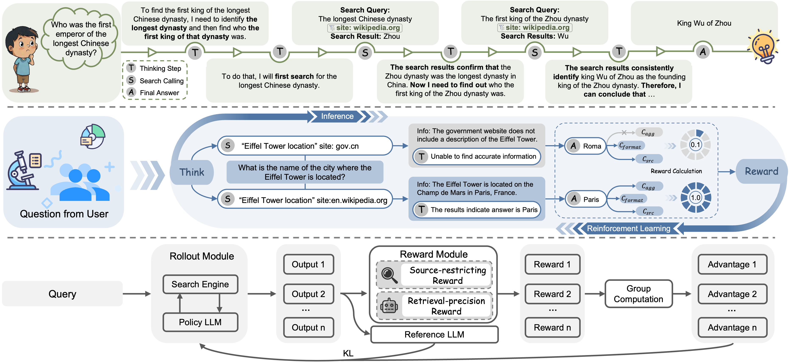
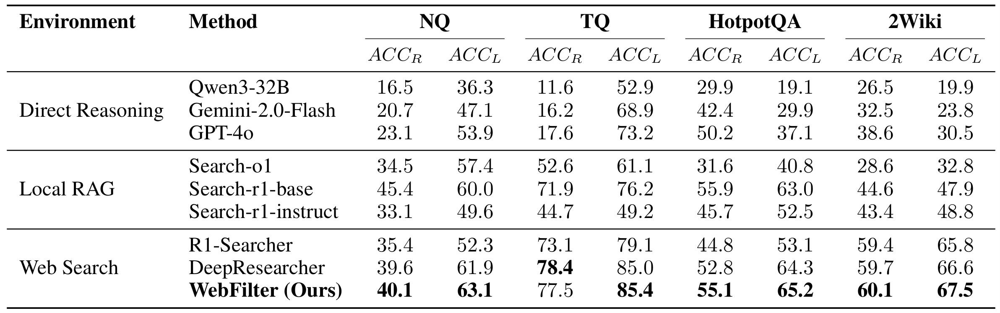
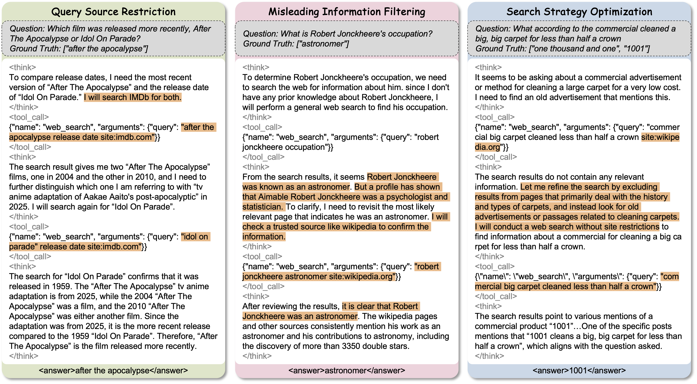
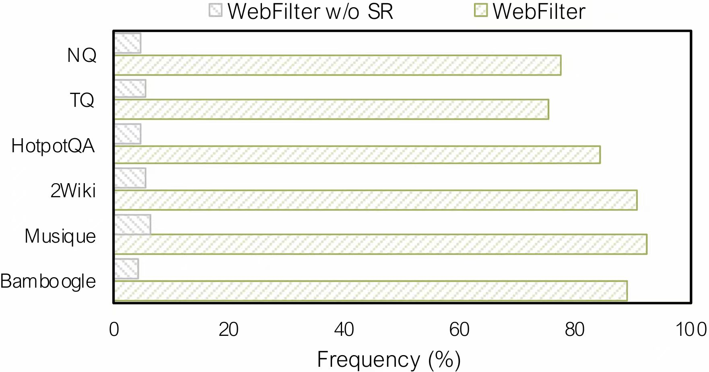

<!-- <h1 align="center">
  
  Careful Queries, Credible Results: Teaching RAG Models Advanced Web Search Tools with Reinforcement Learning
</h1> -->

# Careful Queries, Credible Results: Teaching RAG Models Advanced Web Search Tools with Reinforcement Learning


<div align="center">
<p><em>WebFilter filters noise from the web to deliver reliable, useful information.</em></p>
  
</div>

<p align="center">
  <a href="https://arxiv.org/pdf/2508.07956">
    
  </a>
  <a href="https://github.com/GuoqingWang1/WebFilter">
    
  </a>
  <a href="https://huggingface.co/dayll/WebFilter-7B">
    
  </a>
</p>


## 📝 Introduction

 WebFilter, a novel agentic RAG framework that generates source-restricted queries and filters out unreliable content. This approach combines a retrieval filtering mechanism with a behavior- and outcome-driven reward strategy, optimizing both query formulation and retrieval outcomes. 


<p align="center">        </p>

## 🔥News
- [2025.8.12] 🎉 Our code repository is now open to everyone!  
- [2025.8.12] 🎉 WebFilter is live on [arXiv](https://arxiv.org/pdf/2508.07956) — check it out!
- [2025.8.25] 🎉 WebFilter-7B is now live on [Hugging Face Hub](https://huggingface.co/dayll/WebFilter-7B). 


## 📋 Table of Contents

- [Introduction](#-introduction)
- [Performance](#-performance)
- [Model](#-model)
- [Get Started](#-get-started)
- [Acknowledgement](#-acknowledgement)
- [Contributing](#-contributing)
- [Citation](#-citation)


## 🏆 Performance

Extensive experiments demonstrate that WebFilter hieves state-of-the-art QA performance, with advanced search operator usage rising from 10% to 75%, and significant gains across in-domain and out-of-domain benchmarks. 

<p align="center">
  
</p>

Furthermore, case studies demonstrate WebFilter’s capacity to reason about search scope, cross-verify information across diverse sources, and adapt its strategies to improve retrieval effectiveness.
<p align="center">
  
</p>

In addition to the intuitive performance gains across a wide range of benchmarks, WebFilter effectively encourages the agent to use advanced query syntax with significantly increased frequency during the search process.

<p align="center">
  
</p>


## 🤖 Model
WebFilter is now live on Hugging Face Hub — you’re welcome to explore it anytime:
| Model Name | HF Checkpoint                                                | Size                                                    |
| ---------- | ------------------------------------------------------------ | :------: |
| WebFilter-7b     | [🤗 dayll/WebFilter-7B](https://huggingface.co/dayll/WebFilter-7B) | **7B** 


## 🚀 Get Started

### Package Installation

To begin using this repo, you need to install the required dependencies. You can do this by running the following command:

```bash
git clone https://github.com/GuoqingWang1/WebFilter.git
conda create -n webfilter python=3.10 
conda activate webfilter
cd webfilter
pip3 install torch==2.4.0 --index-url https://download.pytorch.org/whl/cu124
pip3 install flash-attn --no-build-isolation
pip3 install -e .
pip3 install -r requirements.txt
```


### Run backend handler

Running the following command to launch the server handler:
1. Modify ```serper_api_key``` or ```azure_bing_search_subscription_key``` & ```search_engine``` in ```./scrl/handler/config.yaml```
2. Add  ```qwen-plus``` api key in ```./scrl/handler/server_handler.py```
```python
client = OpenAI(
    api_key="sk-xxx",
    base_url="xxxx"
)
```
3. Start server handler:
```bash
 python ./scrl/handler/server_handler.py
```

After launching all server handlers, you can replace ```server_url_list``` in ```./scrl/handler/config.yaml``` in your training host node and then run:
```bash
 python ./scrl/handler/handler.py
```

### 🏋️‍♂️ Training the model
The system prompt for our model can be found in:
```bash
 ./scrl/handler/config.yaml (line 25)
```


If you’d like to train WebFilter yourself, just follow these steps:

Step 1: Choose a Reward Function
- WebFilter SR Reward
```bash
 ./verl/trainer/config/ppo_trainer.yaml # line 152 -> reward_manager: SR_only
```

- WebFilter SR-RR Reward
```bash
 ./verl/trainer/config/ppo_trainer.yaml # line 152 -> reward_manager: SR_RR
```
Retrieval-precision Reward (RR) mode uses a larger, more powerful pretrained LLM to evaluate both the quality of results and the retrieval process.
To enable it, run:
```bash
conda create -n rrm_server --clone webfilter 
conda activate rrm_server
pip install vllm==0.8.5
bash run_llm.sh
```

Step 2: Start Training
Once you’ve set the reward function, launch training with:
```bash
 bash train_grpo.sh
```

### Evaluate
Using the following command to generate rollout:
```bash
 bash evaluate.sh
```
You can find the rollout file in: ```./outputs/{project_name}/{experiment_name}/rollout/rollout_step_0.json```
You can rename and copy it into ```./evaluate/{experiment_name}_result.json```

Then, run the following command:
```bash
 python ./evaluate/cacluate_metrics.py {experiment_name}
```
You can check the score in ```./evaluate/{experiment_name}_score.json```

## 🙏 Acknowledgement 
WebFilter is inspired by [Deepseek-R1](https://github.com/deepseek-ai/DeepSeek-R1), with its implementation built upon [veRL](https://github.com/volcengine/verl), [Search-r1](https://github.com/PeterGriffinJin/Search-R1), and [DeepResearcher](https://github.com/GAIR-NLP/DeepResearcher). We sincerely thank the teams behind these projects for their valuable contributions to open-source research and development.


## 🧑‍🤝‍🧑 Contributing
Grateful beyond words to the incredible contributors who made this project sparkle! ✨🙌💖
<table>
  <tbody>
    <tr>
    <td align="center" width="150">
        <a href="https://github.com/Da1yuqin">
          
        </a>
        <div><strong>Yuqin Dai</strong></div>
        <div>🐶❤😎</div>
      <td align="center" width="150">
        <a href="https://github.com/GuoqingWang1">
          
        </a>
        <div><strong>Guoqing Wang</strong></div>
        <div>🏀💻🥳</div>
      </td>
    </tr>
  </tbody>
</table>

## ✍️ Citation
```bash
@article{dai2025careful,
  title={Careful Queries, Credible Results: Teaching RAG Models Advanced Web Search Tools with Reinforcement Learning},
  author={Dai, Yuqin and Yang, Shuo and Wang, Guoqing and Deng, Yong and Zhang, Zhanwei and Yin, Jun and Zeng, Pengyu and Ying, Zhenzhe and Meng, Changhua and Yi, Can and others},
  journal={arXiv preprint arXiv:2508.07956},
  year={2025}
}
```
